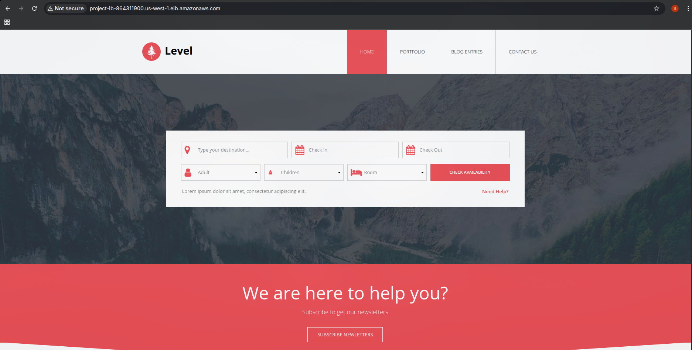
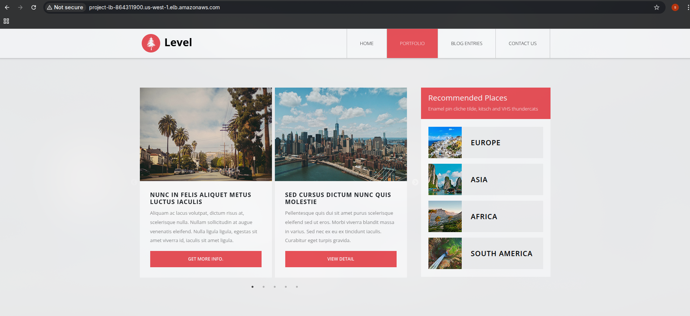

# 🌐 AWS Custom VPC Project – Secure, Scalable & Highly Available Hosting


A fully customized AWS environment designed to host secure, scalable, and highly available applications with real-time monitoring, automated scaling, and a robust backend database.

---

## 📌 Overview
This project demonstrates the creation of a **custom AWS environment** from scratch to host production-ready applications.  
It incorporates **security, scalability, high availability, and monitoring** by leveraging AWS services such as:

- **VPC** (Virtual Private Cloud) – Custom network setup
- **Public & Private Subnets** – Isolated environments for frontend & backend
- **Internet Gateway & NAT Gateway** – Controlled internet access
- **Route Tables & Security Groups** – Fine-grained traffic management
- **Application Load Balancer (ALB)** – Even traffic distribution
- **Auto Scaling Group (ASG)** – Dynamic scaling based on demand
- **SNS (Simple Notification Service)** – Alert notifications
- **CloudWatch Alarms & Dashboards** – Real-time monitoring
- **RDS / Database Server** – Private subnet data storage
- **Custom Domain Integration** – Seamless access via ALB’s DNS

---

## 🏗 Architecture




**Workflow:**
1. **Custom VPC** with separate public & private subnets across multiple Availability Zones.
2. **Public Subnet** hosts ALB & Bastion host (if required).
3. **Private Subnet** hosts EC2 instances & RDS database.
4. **Internet Gateway** allows public resources internet access.
5. **NAT Gateway** enables private resources to update packages securely.
6. **ALB** distributes traffic evenly across EC2 instances in different AZs.
7. **Auto Scaling Group** dynamically adjusts instances based on load.
8. **CloudWatch** monitors CPU utilization and sends alerts via **SNS**.
9. **Custom Domain** points to ALB’s DNS for user-friendly access.

---

## ⚙️ Installation & Setup

### 1️⃣ Clone the Repository
```bash
git clone https://github.com/tony0807133/aws-project.git
cd aws-project
